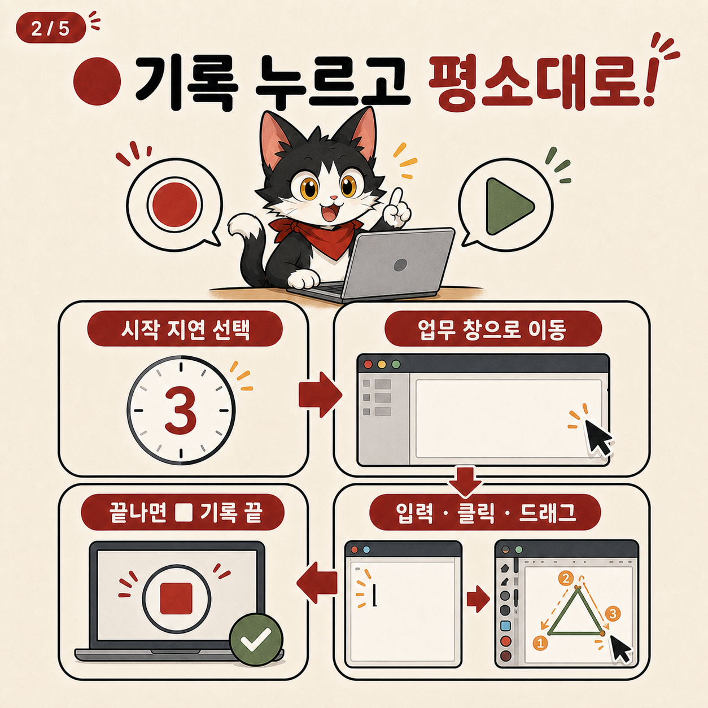
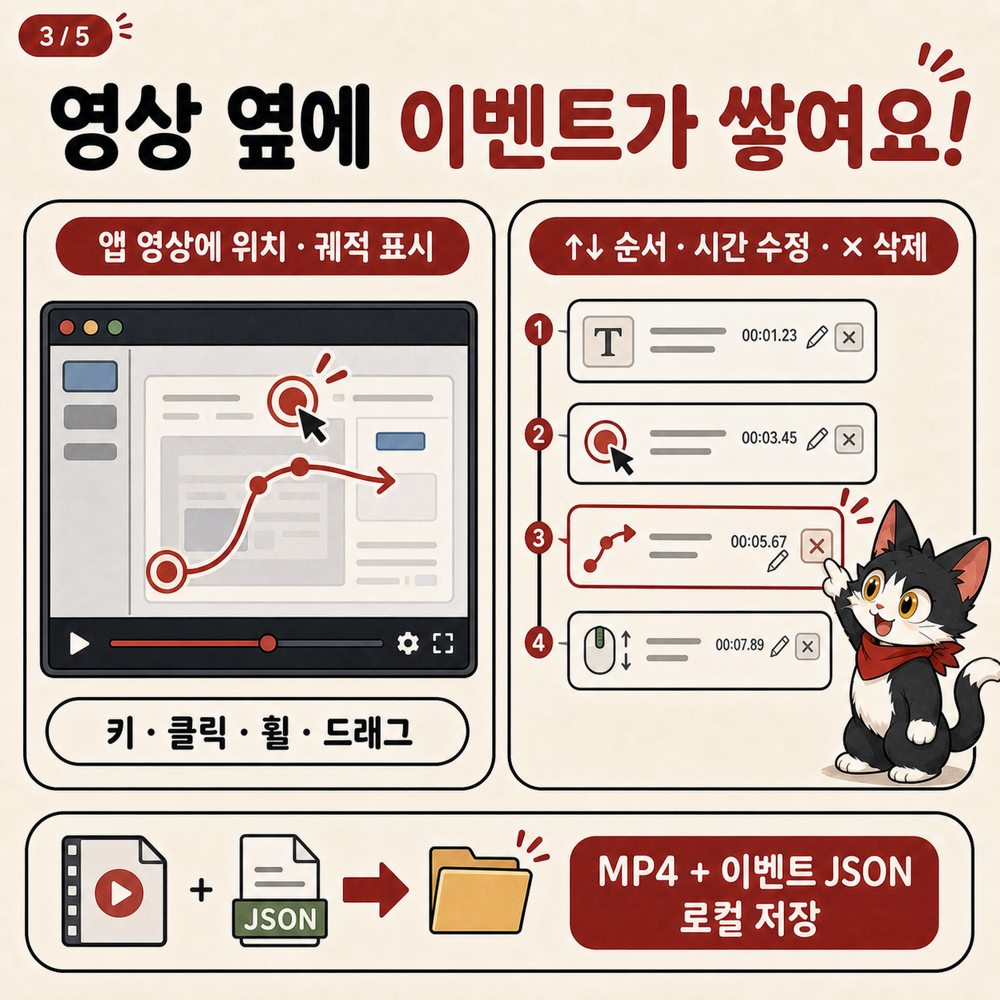
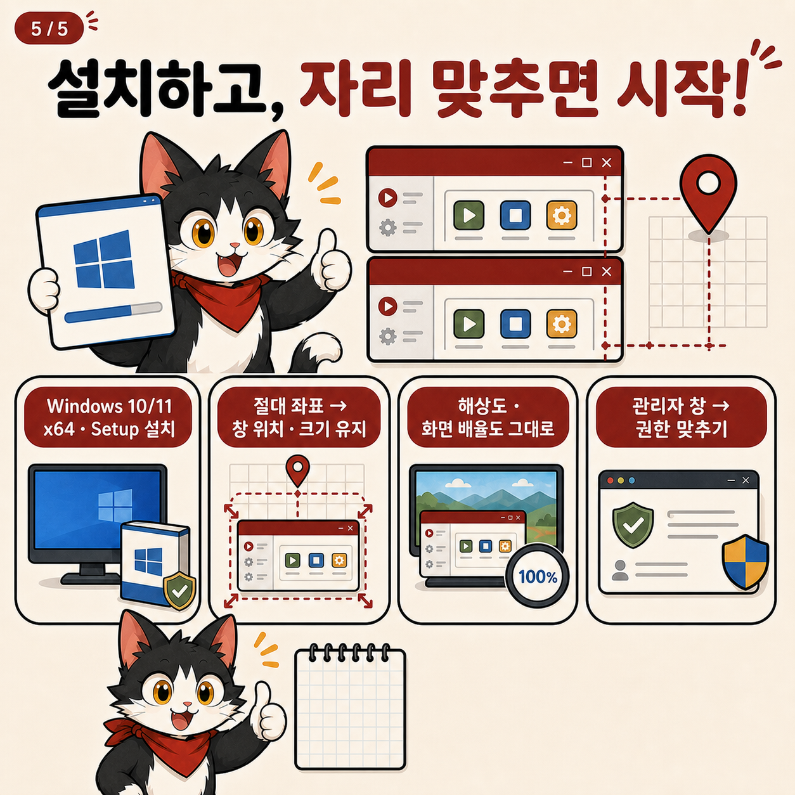
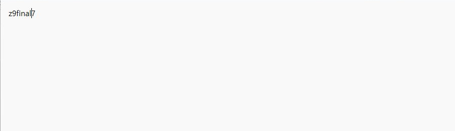
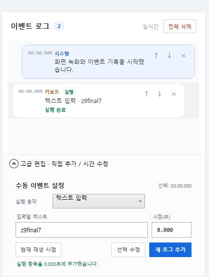
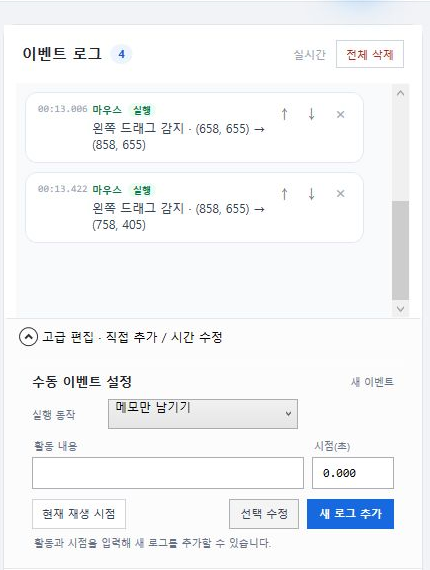
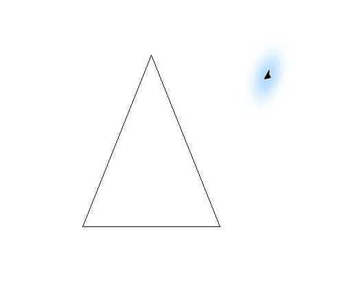
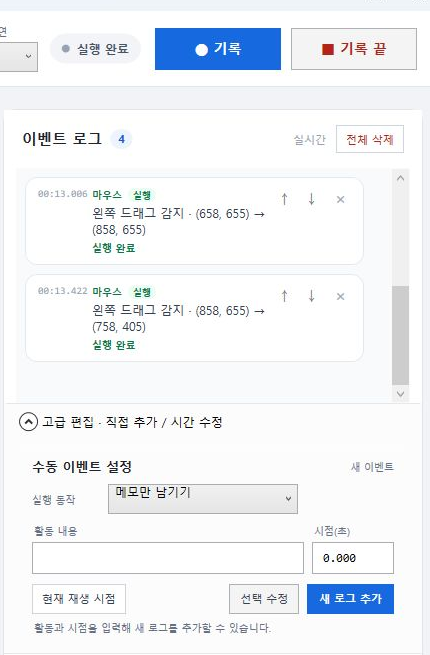
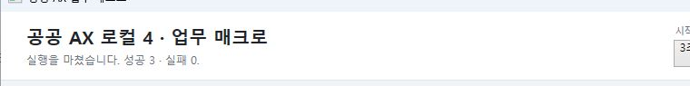

# 공공 AX 로컬 시리즈 4

Windows에서 평소 하던 업무를 한 번 시연하고 그대로 다시 실행하는 로컬 매크로입니다.

> **기록 → 업무 시연 → 기록 끝 → 실행**

화면 영상과 마우스·키보드 이벤트를 함께 기록합니다. 별도의 승인 단계나
`추가 확인`, 민감정보 의심 경고 없이 사용자가 누른 실행 버튼대로 동작하며,
필수 데이터가 깨진 개별 이벤트만 실패로 표시합니다.


## 고양이로 보는 5장 사용법

| 1. 한 번 보여주면 반복 | 2. 기록 누르고 시연 |
| --- | --- |
|  |  |
| 3. 영상과 이벤트 확인 | 4. 기록한 동작 실행 |
|  | ![4장 매크로 실행] |



## 설치

1. [최신 GitHub Release](https://github.com/obundh/gonggong-ax-local-4/releases/latest)를 엽니다.
2. Assets에서 `GonggongAX-Series4-Setup-x64-v4.1.1.exe`를 받습니다.
3. 설치 후 시작 메뉴에서 `공공 AX 업무 매크로`를 실행합니다.

초보자는 필요한 구성 요소를 자동으로 준비하는 Setup 설치파일을 권장합니다. 설치 없이
쓰려면 `GonggongAX-Series4-Portable-x64-v4.1.1.zip`을 받아 새 폴더에 모두 압축
해제하세요. 포터블판은 Microsoft Visual C++ 2015-2022 x64 Runtime이 PC에 이미
설치되어 있어야 합니다. GitHub의 `Source code (zip)`은 실행 프로그램이 아닙니다.

공개 EXE는 아직 코드 서명 인증서로 서명되지 않아 Windows SmartScreen이
표시될 수 있습니다. Setup은 화면 녹화용 Visual C++ Runtime이 없으면 Microsoft 공식
설치파일을 받아 자동 설치하며, 그때만 Windows UAC가 나타날 수 있습니다. 앱 자체는
현재 사용자 영역에 설치됩니다.

## 네 단계 사용법

1. 앱에서 `● 기록`을 누릅니다.
2. 시작 지연 동안 업무 창으로 이동해 평소처럼 입력하고 클릭하거나 드래그합니다.
3. 앱으로 돌아와 `■ 기록 끝`을 누릅니다.
4. 대상 창을 처음 상태로 준비하고 `▶ 실행`을 누릅니다.

실행할 때는 첫 번째 실제 이벤트 전의 빈 대기 시간을 제거합니다. 첫 이벤트는 시작
지연이 끝난 뒤 바로 실행되고, 이후 이벤트 사이의 시간 간격은 녹화한 그대로 유지됩니다.
실행 중에는 `Ctrl + Shift + F12`로 중지할 수 있습니다.

## 지원하는 동작

- 주 모니터 화면 MP4 녹화
- 키 입력과 키 조합
- 왼쪽·오른쪽·가운데 클릭
- 수직·수평 휠
- 마우스 드래그 경로와 각 지점의 상대 시간 저장·재생
- 영상 위 클릭 위치와 드래그 궤적 표시
- 이벤트 삭제, 순서 변경, 시간 수정과 수동 추가
- 실행 결과를 이벤트별 성공·실패로 표시

오른쪽에는 현재 이벤트만 바로 보입니다. 날짜별 `기록 저장소` 탭은 경량 UI에서
제거했고, 직접 추가·시간 수정 기능은 `고급 편집`을 펼쳤을 때만 나타납니다. 녹화
파일과 JSON 저장 자체는 그대로 유지됩니다.

## 실제 동작 검증

v4.1.1 경량 흐름은 외부 Windows 프로그램에서 다음 순서로 확인했습니다.

- **메모장:** 텍스트 입력 이벤트 `z9final7`을 빈 문서에 재생해 `성공 1 · 실패 0` 확인
- **그림판:** 서로 다른 세 번의 드래그를 녹화한 뒤 빈 캔버스에서 세 획 재생 확인
- **종료·드래그 엔진:** 대기 중인 이벤트를 순서대로 비우고, 취소나 오류 시 누른 마우스 버튼을 해제하는 자동 테스트 통과

아래 이미지는 새 빈 메모장과 새 빈 그림판에서 실제 기록·재생을 확인하며 만든 캡처입니다.
제목 표시줄, 탭, 사용자 경로와 다른 화면은 결과 이미지에서 제외했습니다.

| 메모장 재생 결과 | 메모장 실행 로그 |
| --- | --- |
|  |  |
| 그림판 기록 결과 | 기록된 드래그 이벤트 |
|  |  |
| 빈 캔버스 재생 결과 | 드래그 3개 실행 완료 |
|  |  |



처음 실행할 때도 메모장 테스트가 가장 빠릅니다. 자세한 순서는
[초보자 안내서](docs/BEGINNER_GUIDE.md)에 있습니다.

## 저장 위치

영상과 이벤트 JSON은 Windows `비디오` 폴더 아래에 날짜별로 저장됩니다.

```text
공공AX 업무 매크로/
└─ 기록 저장소/
   └─ yyyy/yyyy-MM/yyyy-MM-dd/
      ├─ 업무시연_....mp4
      └─ 업무시연_....mp4.series4.json
```

JSON에는 키, 좌표, 드래그 경로와 시간이 들어 있습니다. 영상과 JSON은 모두 로컬
파일이며 앱이 원격 서버로 업로드하지 않습니다.

## 현재 한계

- Windows 10/11 x64와 주 모니터 한 대를 대상으로 합니다.
- UI 요소 이름을 찾는 방식이 아니라 녹화한 **절대 화면 좌표**를 사용합니다.
- 실행 전 대상 창의 위치, 크기, 해상도와 배율이 달라지면 다른 곳을 누를 수 있습니다.
- 일반 권한 앱은 관리자 권한으로 실행 중인 창에 입력하지 못할 수 있습니다.
- OCR, OpenCV 요소 탐색, 조건 대기, 분기와 재시도는 아직 없습니다.
- 키보드 레이아웃과 IME 상태에 따라 키 재생 결과가 달라질 수 있습니다.
- 이벤트 오버레이는 앱의 영상 플레이어에 표시되며 MP4 픽셀에 합성되지는 않습니다.
- 개인정보 탐지·마스킹·암호화 기능은 없습니다.

## 파일 무결성 확인

Release의 `SHA256SUMS.txt`와 받은 파일의 SHA-256을 비교할 수 있습니다.

```powershell
Get-FileHash .\GonggongAX-Series4-Setup-x64-v4.1.1.exe -Algorithm SHA256
```

## 개발자용 빌드

요구 환경은 Windows x64와 .NET 10 SDK입니다.

```powershell
dotnet restore .\tests\Series4.Desktop.Tests\Series4.Desktop.Tests.csproj --locked-mode
dotnet build .\Series4.Desktop.csproj -c Release -p:Platform=x64 --no-restore
dotnet test .\tests\Series4.Desktop.Tests\Series4.Desktop.Tests.csproj -c Release -p:Platform=x64 --no-restore
```

Inno Setup 6과 Git이 있으면 다음 명령으로 설치 EXE, portable ZIP, 체크섬과
라이선스 대응 소스를 만들 수 있습니다.

```powershell
.\scripts\build-release.ps1
```

내부 구조는 [아키텍처 문서](docs/ARCHITECTURE.md), 로컬에 저장되는 데이터는
[개인정보 및 보안 안내](docs/PRIVACY_AND_SECURITY.md)를 참고하세요.

## 라이선스

프로젝트는 [MIT 라이선스](LICENSE)로 제공합니다. 배포본에는
ScreenRecorderLib·SharpHook·libuiohook·.NET 고지와 필요한 대응 소스가 포함됩니다.
자세한 내용은 [제3자 소프트웨어 고지](THIRD_PARTY_NOTICES.md)에 있습니다.
