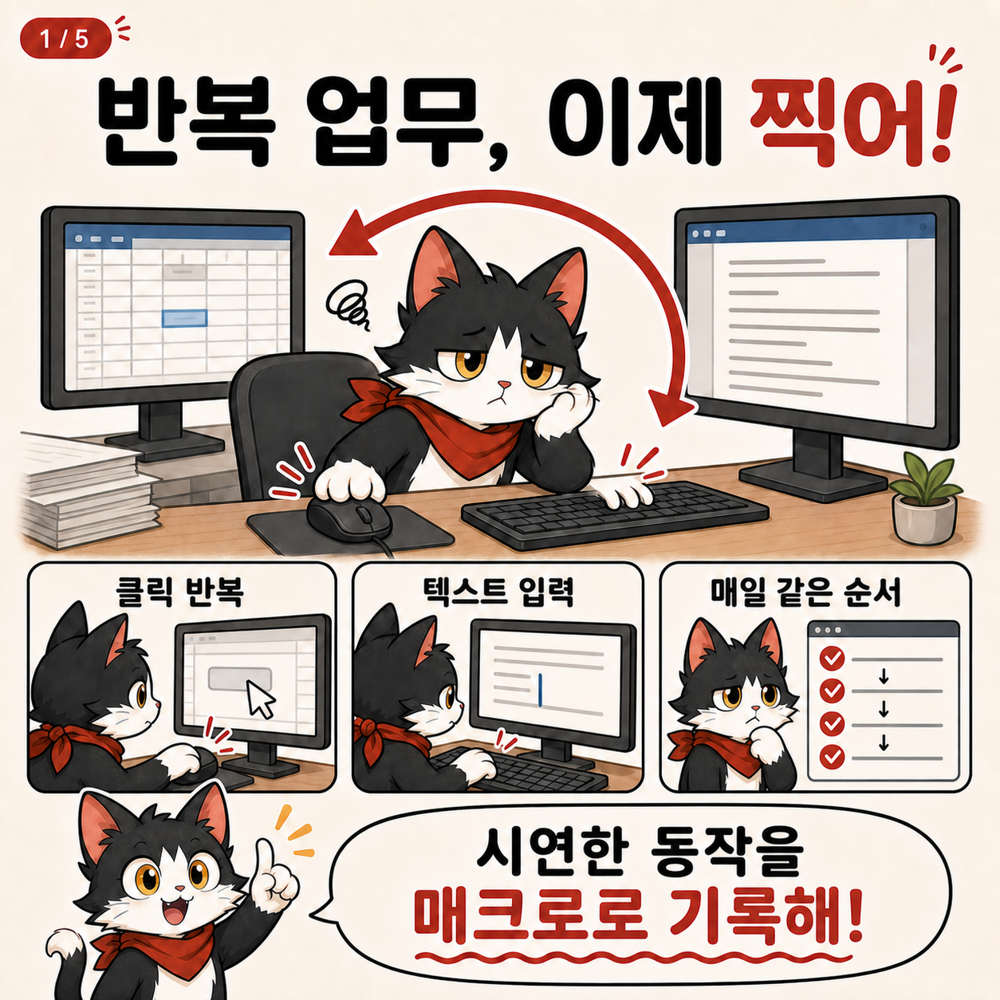

# 공공 AX 로컬 시리즈 4

화면을 녹화하면서 마우스와 키보드 이벤트를 시간순으로 기록하고, 기록을 검토·편집한 뒤 다시 실행해 보는 Windows용 업무 자동화 실험 프로젝트입니다.

> 이 저장소는 **소스 코드만 공개하는 source-only 저장소**입니다. 미리 빌드된 EXE, 설치 파일, 서명된 바이너리 또는 정기적인 바이너리 배포를 제공한다고 약속하지 않습니다.



## 무엇을 할 수 있나요?

- 주 모니터 화면을 MP4 영상으로 녹화
- 녹화 중 발생한 마우스 클릭·휠과 키보드 입력을 타임라인으로 기록
- 영상 위에 이벤트 종류와 발생 위치를 오버레이로 표시
- 이벤트 삭제, 순서 변경, 시간 수정
- 텍스트·키 조합·클릭·휠 동작을 원하는 시간에 수동 삽입
- 영상 재생 속도 조절
- 편집한 이벤트를 시간순으로 실행
- 실행 중 `Ctrl + Shift + F12`로 긴급 중지
- 날짜별 기록 저장소에서 이전 영상과 이벤트 불러오기

녹화 영상과 이벤트 JSON은 날짜별 폴더에 함께 저장됩니다. 미완료 녹화, 영상 길이 밖 시점, 화면 크기 변화, 창 전환 키, 민감정보 의심 항목은 경고로 표시하지만 실행을 막지 않습니다. 깨진 입력 데이터나 현재 엔진이 재생할 수 없는 동작만 개별 실행 대상에서 제외됩니다.

## 먼저 알아야 할 점

이 프로그램은 좌표와 키 입력을 재생하는 데스크톱 매크로입니다. 사람처럼 화면의 의미를 이해하거나, 버튼 이름을 찾아서 클릭하는 도구가 아닙니다.

- Windows x64 전용 WPF 프로젝트입니다.
- 프로젝트와 전역 입력 훅 충돌을 막기 위해 한 사용자 세션에서 한 인스턴스만 실행합니다.
- 현재 주 모니터 한 대만 녹화합니다.
- 마우스 이동 경로와 드래그는 아직 실행하지 않습니다. 드래그 이벤트는 기록과 영상 오버레이에 남고 `실행 불가` 이유를 표시합니다.
- 녹화할 때와 실행할 때 주 모니터의 위치·해상도가 다르면 경고를 표시한 뒤 기존 절대 좌표로 실행합니다.
- 관리자 권한으로 실행된 프로그램은 일반 권한으로 실행한 이 앱이 조작하지 못할 수 있습니다.
- 화면 전환을 기다리는 조건, OCR, OpenCV 기반 요소 탐색, 분기와 재시도는 아직 없습니다.
- 이벤트 오버레이는 앱에서 영상을 재생할 때 JSON 로그와 함께 표시됩니다. 현재 MP4 파일 자체에 주석을 합성해 내보내지는 않습니다.
- 영상과 입력 이벤트에는 개인정보나 비밀 정보가 포함될 수 있습니다. 텍스트 이벤트는 로컬 규칙으로 의심 형식을 표시하지만, 영상 자동 마스킹이나 암호화 저장 기능은 현재 없습니다.

중요한 업무에 바로 적용하기 전에 테스트용 문서와 테스트 계정에서 충분히 검증하세요.

## 소스에서 빌드하기

### 요구 환경

- Windows 10 또는 Windows 11 x64
- [.NET 10 SDK](https://dotnet.microsoft.com/download/dotnet/10.0)
- PowerShell 또는 Windows Terminal

저장소 폴더에서 다음 명령을 실행합니다.

```powershell
dotnet --version
dotnet restore .\tests\Series4.Desktop.Tests\Series4.Desktop.Tests.csproj --locked-mode
dotnet build .\Series4.Desktop.csproj -c Release -p:Platform=x64 --no-restore
dotnet test .\tests\Series4.Desktop.Tests\Series4.Desktop.Tests.csproj -c Release -p:Platform=x64 --no-restore
```

개발 상태로 바로 실행하려면:

```powershell
dotnet run --project .\Series4.Desktop.csproj -c Debug -p:Platform=x64
```

본인이 사용할 로컬 출력물을 만들려면:

```powershell
dotnet publish .\Series4.Desktop.csproj `
  -c Release `
  -r win-x64 `
  --self-contained true `
  -p:Platform=x64 `
  -o .\artifacts\publish\win-x64
```

`publish` 명령은 사용자의 PC에서 로컬 실행 파일을 만드는 방법일 뿐, 이 저장소가 해당 바이너리를 배포하거나 지원한다는 뜻은 아닙니다.

## 처음 사용한다면

1. [초보자 안내서](docs/BEGINNER_GUIDE.md)를 따라 테스트 녹화를 만드세요.
2. 실행 전에 타임라인의 좌표와 시간을 확인하세요.
3. 대상 프로그램을 원하는 상태로 준비하세요.
4. 시작 지연 시간을 두고 실행한 뒤, 언제든 `Ctrl + Shift + F12`로 중지할 준비를 하세요.

내부 동작과 파일 구조는 [아키텍처 문서](docs/ARCHITECTURE.md)에 정리되어 있습니다.
실제 녹화나 Git 공유 전에는
[개인정보 및 보안 가이드](docs/PRIVACY_AND_SECURITY.md)를 먼저 확인하세요.

## 주요 소스 파일

```text
Series4.Desktop/
├─ App.xaml
├─ MainWindow.xaml              # 화면 구성
├─ MainWindow.xaml.cs           # 녹화·편집·실행 흐름
├─ RecordedEvent.cs             # 타임라인 이벤트 모델
├─ MacroEventPolicy.cs          # 경고와 기술적 실행 불가 판정
├─ MacroActionKind.cs           # 실행 동작 종류
├─ MacroProjectStore.cs         # JSON sidecar와 날짜별 저장소
├─ MacroProjectSummary.cs       # 과거 기록 목록 모델
├─ docs/
│  ├─ BEGINNER_GUIDE.md
│  ├─ ARCHITECTURE.md
│  └─ PRIVACY_AND_SECURITY.md
└─ tests/Series4.Desktop.Tests/ # 경고·실행 정책 회귀 테스트
```

## 라이선스와 외부 구성요소

프로젝트 라이선스는 [LICENSE](LICENSE), 사용한 외부 구성요소와 고지는 [THIRD_PARTY_NOTICES.md](THIRD_PARTY_NOTICES.md)를 확인하세요. 주요 NuGet 의존성은 `ScreenRecorderLib`와 `SharpHook`이며, 정확한 버전은 `Series4.Desktop.csproj`가 기준입니다.

## 기여할 때

- 경고는 사용자의 실행 선택을 막지 않아야 하며, 기술적으로 실행할 수 없는 개별 이벤트만 제외해야 합니다.
- 긴급 중지와 입력 상태 정리 실패는 전체 실행 중지 조건으로 유지하세요.
- 저장 포맷을 바꿀 때는 기존 `.series4.json`을 읽을 수 있는지 확인하세요.
- 녹화·실행·저장 실패를 성공으로 표시하지 마세요.
- 실제 환경에서 검증하지 않은 동작은 문서에서 검증 완료라고 표현하지 마세요.
