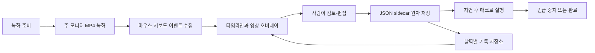

# 아키텍처

[README로 돌아가기](../README.md)

## 목표와 경계

공공 AX 로컬 시리즈 4는 한 번의 업무 시연에서 영상과 입력 이벤트를 함께 수집하고, 사람이 타임라인을 검토·편집한 뒤 같은 Windows 데스크톱 환경에서 다시 실행하는 WPF 애플리케이션입니다.

이 프로젝트의 자동화 단위는 접근성 트리나 업무 의미가 아니라 다음과 같은 저수준 이벤트입니다.

- 텍스트 입력
- 키 또는 키 조합
- 화면 좌표의 마우스 클릭
- 수직·수평 휠

따라서 “저장 버튼을 찾아 클릭”하는 의미 기반 자동화가 아니라 “기록된 시간에 특정 좌표를 클릭”하는 좌표 기반 자동화입니다.

## 실행 환경

- Target framework: `net10.0-windows`
- UI: WPF
- Platform target: Windows x64
- Runtime identifier: `win-x64`
- 화면 녹화: `ScreenRecorderLib`
- 전역 입력 감지와 키 입력 시뮬레이션: `SharpHook`
- 마우스 입력 전송: Windows `SendInput`, `SetCursorPos`

정확한 패키지 버전은 `Series4.Desktop.csproj`를 기준으로 합니다. 라이선스 정보는 [LICENSE](../LICENSE)와 [THIRD_PARTY_NOTICES.md](../THIRD_PARTY_NOTICES.md)를 확인하세요.

## 구성 요소

### `MainWindow.xaml`

한 화면 안에 다음 UI를 배치합니다.

- 녹화와 실행 제어
- 영상 플레이어, 재생 위치, 재생 속도
- `현재 기록` 탭의 이벤트 목록과 수동 편집기
- `기록 저장소` 탭의 날짜별 프로젝트 목록
- 저장 경로와 긴급 중지 안내

### `MainWindow.xaml.cs`

현재 애플리케이션의 조정자 역할을 합니다.

- 녹화 준비·시작·중지·실패 상태 관리
- 전역 마우스·키보드 훅 연결
- 훅 이벤트를 `RecordedEvent`로 변환
- 타임라인 추가·삭제·정렬·수정
- 영상 오버레이 렌더링
- 매크로 실행과 중지
- 자동 저장, 종료 전 저장, 프로젝트 전환
- 기록 저장소 새로고침과 선택 기록 불러오기

프로토타입의 복잡성을 줄이기 위해 별도 MVVM 프레임워크 없이 code-behind 중심으로 구성되어 있습니다.

### `RecordedEvent.cs`

타임라인 한 항목을 표현합니다.

- `Offset`: 녹화 시작부터 이벤트까지의 시간
- `Sequence`: 같은 시간에 있는 이벤트의 안정적인 순서
- `ActionKind`: 메모, 텍스트, 키, 클릭, 휠 구분
- `KeyCodes`, `ModifierKeyCodes`: 실제 키 payload
- `ScreenX`, `ScreenY`: 녹화 당시 화면 좌표
- `CaptureLeft/Top/Width/Height`: 좌표를 기록한 화면 범위
- `WheelRotation`, `IsHorizontalWheel`: 휠 방향과 크기
- `ReviewWarningText`: 실행을 막지 않는 사용자 확인 정보
- `IsQuarantined`, `QuarantineReason`: payload 손상이나 미지원 동작처럼 기술적으로 실행할 수 없는 상태
- `LastExecutionResult`, `LastExecutionFailed`: 현재 세션의 이벤트별 실행 결과
- 화면 표시용 분류, 메시지, 오버레이 문구

`IsExecutable`은 동작 종류가 있고 기술적 `실행 불가` 상태가 아닌 이벤트만 참이 됩니다. `ReviewWarningText`는 이 값을 거짓으로 바꾸지 않습니다.

### `MacroActionKind.cs`

현재 실행기가 처리하는 동작 종류를 정의합니다.

```text
None
TextEntry
KeyStroke
MouseLeftClick
MouseRightClick
MouseMiddleClick
MouseWheel
```

### `MacroProjectStore.cs`

영상 옆 JSON sidecar와 날짜별 저장소를 관리합니다.

- 포맷 버전 검사
- `RecordedEvent`와 JSON DTO 변환
- `KeyCode`를 숫자가 아닌 enum 이름 문자열로 저장
- 상대 영상 경로 해석
- 임시 파일 작성·flush 후 대상 파일 교체
- 최근 프로젝트 포인터 저장
- 날짜별 폴더와 프로젝트 요약 목록 생성
- 손상된 sidecar를 다른 정상 기록과 분리해 표시

### `MacroProjectSummary.cs`

기록 저장소 목록에 필요한 읽기 전용 요약입니다.

- 녹화 시각과 마지막 저장 시각
- 완료·중단·검토 필요 상태
- 이벤트 수와 실행 가능 수
- 영상 존재 여부
- 읽기 오류와 불러오기 가능 여부

## 전체 흐름



## 녹화 상태 흐름

1. 새 녹화를 시작하기 전에 현재 프로젝트를 저장합니다.
2. 새 MP4 경로는 날짜별 저장소 아래에 충돌하지 않는 이름으로 만듭니다.
3. `ScreenRecorderLib`가 실제 `Recording` 상태를 보고한 뒤 전역 입력 수집을 시작합니다.
4. 이 시점에 새 녹화 세션을 `InProgress` 상태로 저장합니다.
5. 마우스와 키보드 훅 이벤트는 WPF Dispatcher를 통해 타임라인에 추가됩니다.
6. 녹화 완료 콜백이 오면 영상을 불러오고 프로젝트를 `Completed`로 저장합니다.
7. 준비 실패나 중단이 있으면 성공으로 표시하지 않고 `Failed` 상태와 경고를 남깁니다. 상태가 `Failed`여도 사용자가 실행 버튼을 누르면 이벤트 실행은 가능합니다.

이벤트 훅은 앱 자신의 창에서 발생한 클릭을 업무 이벤트로 다시 기록하지 않도록 필터링합니다.

## 마우스 클릭과 드래그

마우스 버튼을 누른 순간 바로 클릭 이벤트로 확정하지 않습니다.

1. 누른 버튼, 시작 좌표, modifier와 시간을 임시 보관합니다.
2. 버튼을 누른 채 움직였는지 감지합니다.
3. 버튼을 놓았을 때 이동 거리와 드래그 여부를 평가합니다.
4. 일반 클릭만 실행 가능한 좌표 이벤트로 만듭니다.
5. 드래그는 시작·끝 좌표를 로그에 남기지만 현재 실행기가 재생할 데이터가 부족하므로 `실행 불가`로 표시합니다.

이 방식은 드래그의 시작점을 일반 클릭으로 잘못 실행하는 위험을 줄입니다.

## 이벤트 편집과 정렬

타임라인의 기준은 `(Offset, Sequence)`입니다.

- 새 이벤트는 이 순서에 맞춰 삽입됩니다.
- 시간이 다른 인접 이벤트의 순서를 바꾸면 시간을 함께 교환합니다.
- 시간이 같으면 `Sequence`를 교환합니다.
- 시간을 수정한 뒤 전체 목록을 다시 정규화합니다.
- 실행기도 같은 `(Offset, Sequence)` 순서를 사용합니다.

기록된 마우스 이벤트의 시간이나 설명만 바꾸는 경우 원래 좌표와 휠 payload를 유지합니다. 동작 자체를 수동 동작으로 바꾸면 실행 시점 커서 위치를 사용하는 이벤트가 될 수 있으므로 UI 메시지를 확인해야 합니다.

## 영상 오버레이

현재 영상 시점에서 일정 시간 안에 있는 이벤트를 골라 오버레이합니다.

- 유효한 녹화 좌표가 있으면 녹화 범위를 영상 표시 영역으로 환산합니다.
- 좌표가 없으면 상단 배너 형태로 표시합니다.
- 경고 이벤트는 주황색, 실행 불가 이벤트는 빨간색으로 표시하며 영상에서 숨기지 않습니다.
- 실제 영상의 letterbox 영역을 고려해 좌표를 영상 콘텐츠 영역에 맞춥니다.

오버레이는 사용자의 검토를 돕는 표시이며, 실행 성공을 증명하는 결과 로그는 아닙니다.

## 매크로 실행

1. 미완료 녹화, 영상 길이 밖 시간, 화면 범위 변화, 창 전환 키와 민감정보 의심 형식을 경고로 계산합니다.
2. 빈 payload, 부분·비정상 좌표, 긴급 중지 키 자체와 미지원 드래그만 개별 실행 목록에서 제외합니다.
3. 실행 직전 최신 프로젝트 저장을 시도하되 실패하면 현재 메모리 내용으로 계속 실행합니다.
4. 시작 지연 중 대상 입력 창을 기억합니다.
5. `Stopwatch`를 시작하고 각 `Offset`까지 기다립니다.
6. 텍스트는 Unicode `SendInput`, 키 조합은 `SharpHook EventSimulator`의 개별 누르기·떼기, 마우스는 Windows 입력 API로 전송합니다. 각 입력 전송 수와 키 해제를 확인합니다.
7. 일반 이벤트 하나가 실패하면 해당 로그에 결과를 남기고 다음 이벤트를 계속합니다.
8. 입력 버튼·modifier 해제 실패, 취소 토큰 또는 `Ctrl + Shift + F12`가 감지되면 전체 실행을 중단합니다.

키보드 이벤트 전송 전에 대상 foreground 창이 유효한지 다시 확인합니다. 긴급 중지는 이미 외부 프로그램이 처리한 결과를 되돌리는 트랜잭션 기능은 아닙니다.

## 저장 포맷과 폴더

기본 프로젝트 루트는 Windows의 `비디오` 폴더 아래 `공공AX 업무 매크로`입니다. `비디오` 폴더를 얻을 수 없으면 LocalAppData 아래 폴더를 사용합니다.

```text
공공AX 업무 매크로/
└─ 기록 저장소/
   └─ yyyy/
      └─ yyyy-MM/
         └─ yyyy-MM-dd/
            ├─ 업무시연_yyyyMMdd_HHmmss_fff_GUID.mp4
            └─ 업무시연_yyyyMMdd_HHmmss_fff_GUID.mp4.series4.json
```

sidecar의 주요 필드는 다음과 같습니다.

```text
version
currentVideoPath
savedAtUtc
status
events[]
```

영상 경로는 sidecar 폴더를 기준으로 상대 경로로 저장합니다. 따라서 MP4와 JSON을 같은 구조로 함께 옮기면 다시 연결할 수 있습니다.

최근 프로젝트 포인터는 다음 위치에 별도로 저장합니다.

```text
%LOCALAPPDATA%\공공AX 업무 매크로\last-project.json
```

### 원자 저장

JSON을 대상 파일에 직접 덮어쓰지 않습니다.

1. 같은 폴더에 고유한 임시 파일을 생성합니다.
2. JSON 직렬화를 완료합니다.
3. stream을 flush하고 디스크 flush를 요청합니다.
4. 임시 파일을 대상 sidecar로 교체합니다.
5. 실패하면 남은 임시 파일을 정리합니다.

UI의 자동 저장은 `SemaphoreSlim`과 revision 번호로 직렬화하여 오래된 snapshot이 새 snapshot을 뒤늦게 덮지 않도록 합니다. 새 녹화, 매크로 실행, 프로젝트 전환, 앱 종료 전에는 저장 완료를 기다립니다.

## 기록 저장소 불러오기

목록 새로고침은 sidecar를 읽기만 하며 최근 프로젝트 포인터를 변경하지 않습니다.

선택 기록을 불러올 때는:

1. 녹화나 매크로 실행 중인지 검사합니다.
2. 현재 프로젝트를 먼저 저장합니다.
3. 선택한 sidecar 전체를 파싱합니다.
4. 이전 영상 source를 해제합니다.
5. 이벤트와 상태를 새 프로젝트로 교체합니다.
6. 성공한 뒤에만 최근 프로젝트 포인터를 변경합니다.

손상된 sidecar 하나는 목록 전체를 막지 않습니다. 오류 상태의 행으로 남기고 불러오기만 제한합니다.

## 스레드와 비동기 경계

- WPF UI 상태는 Dispatcher 스레드에서 변경합니다.
- SharpHook의 전역 이벤트는 캡처 값을 복사한 뒤 Dispatcher에 전달합니다.
- Recorder 상태 콜백도 Dispatcher를 통해 UI 흐름에 합류합니다.
- 매크로의 실제 입력 전송은 UI가 멈추지 않도록 별도 작업에서 실행합니다.
- 프로젝트 저장은 semaphore로 한 번에 하나만 수행합니다.
- 기록 저장소 새로고침은 취소 토큰으로 오래된 요청을 폐기합니다.

## 실행 통제와 기술적 경계

- 사용자 세션당 단일 인스턴스 mutex
- 앱 자신의 창에서 발생한 입력 제외
- 화면 변화·미완료 상태·영상 밖 이벤트는 경고만 표시
- 드래그와 깨진 payload는 개별 `실행 불가` 표시
- 녹화 당시 화면 범위와 현재 범위 비교 결과를 사용자에게 표시
- 키보드 입력 대상 foreground 창 확인
- 실행 직전 저장 실패 시 현재 메모리 이벤트로 계속 실행
- 녹화·매크로 실행 중 편집 UI 잠금
- 전역 `Ctrl + Shift + F12` 중지

경고는 실행을 막지 않습니다. 실행 버튼을 누르는 행위가 경고를 포함해 실행하겠다는 사용자의 결정이며, 프로그램은 외부 업무 결과를 대신 판정하지 않습니다.

## 현재 한계

- Windows x64와 WPF에 종속됩니다.
- 한 번에 주 모니터 한 대만 녹화합니다.
- 좌표 기반이므로 창 위치, 해상도, 디스플레이 배율, 원격 데스크톱 환경 변화에 민감합니다.
- 마우스 이동 경로와 드래그 재생은 지원하지 않습니다.
- UI Automation, 접근성 요소 선택자, OCR, 이미지 템플릿 탐색을 사용하지 않습니다.
- 화면이 준비될 때까지 의미적으로 기다리는 조건과 분기·반복·재시도 규칙이 없습니다.
- 일반 권한 프로세스가 관리자 권한 창에 입력을 보내는 것은 Windows가 차단할 수 있습니다.
- 키보드 레이아웃, IME 상태와 대상 앱 동작에 따라 녹화 키 재생 결과가 달라질 수 있습니다.
- 오디오는 녹음하지 않습니다.
- 이벤트 오버레이는 WPF 플레이어에서 사이드카 로그를 합성해 보여 주며 MP4 픽셀에 영구 합성하지 않습니다.
- 수동 텍스트의 일부 민감정보 형식만 로컬 규칙으로 경고합니다. 영상 픽셀과 녹화된 개별 키 입력을 완전하게 탐지하거나 마스킹·암호화 저장하는 기능은 없습니다.
- 자동화 결과가 성공했는지 대상 업무 데이터를 읽어 검증하는 기능은 없습니다.

## 빌드

```powershell
dotnet restore .\Series4.Desktop.csproj --locked-mode
dotnet build .\Series4.Desktop.csproj -c Release -p:Platform=x64
```

이 저장소는 source-only입니다. 빌드된 EXE나 설치 프로그램의 공개 배포를 보장하지 않습니다.
