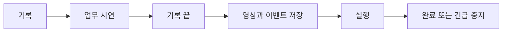

# 아키텍처

[README로 돌아가기](../README.md)

## 목표

공공 AX 로컬 시리즈 4는 한 번의 Windows 업무 시연에서 화면과 입력 이벤트를 함께
기록하고 같은 입력을 다시 실행하는 WPF 애플리케이션입니다. v4.1.0의 기본 흐름은
다음 네 단계로 고정했습니다.

```text
기록 → 업무 시연 → 기록 끝 → 실행
```

접근성 트리나 버튼 이름을 해석하지 않고 다음 저수준 이벤트를 사용합니다.

- 텍스트와 키 조합
- 화면 좌표의 마우스 클릭
- 수직·수평 휠
- 시간 정보가 포함된 마우스 드래그 경로

## 실행 환경

- Target framework: `net10.0-windows`
- UI: WPF
- Platform/RID: Windows x64 / `win-x64`
- 화면 녹화: `ScreenRecorderLib`
- 전역 입력 감지와 키 재생: `SharpHook`
- 마우스 입력 전송: Windows `SendInput`, `SetCursorPos`

정확한 버전은 `Series4.Desktop.csproj`, 라이선스는 [THIRD_PARTY_NOTICES.md](../THIRD_PARTY_NOTICES.md)를 기준으로 합니다.

## UI 구성

### `MainWindow.xaml`

- 상단: 기록, 기록 끝, 실행, 실행 중지와 시작 지연
- 왼쪽: 영상 플레이어, 재생 속도와 이벤트 오버레이
- 오른쪽: 현재 이벤트 목록
- 하단 Expander: 직접 추가와 시간 수정을 위한 고급 편집
- 저장 경로와 전역 긴급 중지 안내

날짜별 `기록 저장소` 탭은 v4.1.0 경량 화면에서 숨겼습니다. 고급 편집도 기본으로
접혀 있어 단순 기록·실행 흐름을 방해하지 않습니다. 저장소와 편집 코드 자체는 기존
프로젝트 호환을 위해 남아 있습니다.

### `MainWindow.xaml.cs`

다음 흐름을 조정합니다.

- 녹화 준비·시작·종료와 Recorder 콜백
- 전역 마우스·키보드 훅
- 훅 이벤트의 `RecordedEvent` 변환
- 이벤트 목록 추가·삭제·정렬·수정
- 영상 오버레이
- 시간순 매크로 실행과 중지
- JSON 자동 저장과 종료 전 정리

별도 MVVM 프레임워크 없이 code-behind 중심으로 구성합니다.

## 데이터 모델

### `MacroActionKind`

```text
None
TextEntry
KeyStroke
MouseLeftClick
MouseRightClick
MouseMiddleClick
MouseDrag
MouseWheel
```

### `RecordedEvent`

공통 필드는 다음과 같습니다.

- `Offset`, `Sequence`: 녹화 시점과 같은 시점 안의 순서
- `ActionKind`: 실행 동작 종류
- `KeyCodes`, `ModifierKeyCodes`: 키 payload
- `ScreenX`, `ScreenY`: 클릭 또는 드래그 시작 좌표
- `CaptureLeft/Top/Width/Height`: 녹화 당시 화면 범위
- `WheelRotation`, `IsHorizontalWheel`: 휠 데이터
- `LastExecutionResult`, `LastExecutionFailed`: 실행 결과

드래그에는 다음 필드가 추가됩니다.

- `EndScreenX`, `EndScreenY`: 종료 좌표
- `DragButton`: 누른 마우스 버튼
- `DragDuration`: 전체 드래그 시간
- `MousePath[]`: 시작점부터 끝점까지 `(상대 시간, X, Y)` 배열

`IsExecutable`은 동작 종류가 있고 기술적으로 손상된 상태가 아닌 경우 참입니다.
v4.1.0 기본 UI는 승인, `추가 확인`, 민감정보 의심 경고를 만들지 않습니다. 빈 payload,
필수 좌표나 드래그 경로 누락처럼 엔진이 실행할 수 없는 데이터만 실패 처리합니다.

## 전체 흐름



## 녹화와 이벤트 수집

1. 시작 지연이 끝나면 Recorder를 준비합니다.
2. 주 모니터 MP4의 고유 경로를 만듭니다.
3. Recorder가 `Recording` 상태를 알리면 전역 입력 훅을 시작하고 `HookEnabled` 준비
   신호를 기다린 뒤 녹화 시계와 이벤트 기록 상태를 켭니다.
4. 훅 콜백은 마우스·키 snapshot을 순서 보존 큐에 넣고 즉시 반환합니다. 단일 consumer가
   발생 순서대로 UI 이벤트 목록에 반영합니다.
5. 기록 끝을 누르면 새 훅 수신을 멈추고 큐를 닫은 뒤 마지막 snapshot까지 모두 반영해
   MP4와 JSON을 마무리합니다.
6. 완성된 영상에 이벤트 오버레이를 연결합니다.

앱 자신의 창에서 시작된 입력은 업무 이벤트로 다시 기록하지 않습니다.

## 클릭과 드래그

버튼을 누른 순간에는 클릭인지 드래그인지 확정하지 않습니다.

1. 버튼, 시작 좌표, modifier와 시작 시간을 보관합니다.
2. 버튼을 누른 채 이동할 때 좌표와 상대 시간을 경로에 추가합니다.
3. 버튼을 놓을 때 끝점을 강제로 추가합니다.
4. 움직임이 없으면 클릭, 움직임이 있으면 `MouseDrag`로 만듭니다.

`MouseDragReplayEngine`은 경로를 시간순으로 정렬한 뒤 다음 순서로 실행합니다.

```text
시작점 이동 → 버튼 누름 → 경로별 대기와 이동 → 버튼 해제
```

취소나 이동 오류가 발생해도 `finally`에서 누른 마우스 버튼을 해제합니다. 버튼 해제
자체가 실패하면 다음 이벤트로 넘어가지 않고 전체 실행을 중단합니다. 영상 오버레이에서는
저장한 경로를 `Polyline`으로 표시합니다.

## 매크로 실행

1. 기술적으로 실행 가능한 이벤트를 `(Offset, Sequence)` 순으로 정렬합니다.
2. 첫 번째 실행 이벤트의 `Offset`을 기준 시점으로 잡습니다.
3. 각 이벤트는 `기록 시점 - 첫 이벤트 시점`에 실행합니다.
4. 클릭·키·휠·드래그 payload를 Windows 입력으로 전송합니다.
5. 개별 이벤트 실패는 해당 행에 표시하고 다음 이벤트를 계속합니다.
6. 취소, 입력 해제 실패 또는 `Ctrl + Shift + F12`가 오면 전체 실행을 중지합니다.

2번 때문에 녹화 시작 후 첫 업무 동작까지의 빈 시간은 재생하지 않습니다. 첫 동작은
실행 카운트다운 직후 시작하고, 이후 이벤트 간격은 원래 시연과 같습니다.

키 입력 전에는 현재 foreground 창을 확인합니다. 시작 지연 동안 사용자가 선택한
외부 창을 실행 대상으로 기억합니다.

## 저장 포맷

기본 루트는 Windows `비디오` 폴더 아래 `공공AX 업무 매크로`입니다.

```text
공공AX 업무 매크로/
└─ 기록 저장소/
   └─ yyyy/yyyy-MM/yyyy-MM-dd/
      ├─ 업무시연_yyyyMMdd_HHmmss_fff_GUID.mp4
      └─ 업무시연_yyyyMMdd_HHmmss_fff_GUID.mp4.series4.json
```

sidecar 주요 필드는 다음과 같습니다.

```text
version
currentVideoPath
savedAtUtc
status
events[]
  ├─ actionKind / offsetTicks / sequence
  ├─ keyCodes / modifierKeyCodes
  ├─ screenX / screenY / capture bounds
  └─ endScreenX / endScreenY / dragButton / dragDurationTicks / mousePath[]
```

JSON은 임시 파일 작성과 flush 후 대상 파일로 교체합니다. 저장 작업은
`SemaphoreSlim`과 revision 번호로 직렬화해 오래된 snapshot의 역전 덮어쓰기를
막습니다. 기존 JSON에 새 드래그 필드가 없으면 빈 값으로 읽어 이전 기록과의 호환을
유지합니다.

## 스레드 경계

- WPF 상태 변경은 Dispatcher 스레드에서 수행합니다.
- SharpHook 콜백은 캡처 값을 복사해 Dispatcher로 전달합니다.
- Recorder 콜백도 Dispatcher에서 UI 상태와 합류합니다.
- 입력 전송은 UI가 멈추지 않도록 별도 작업에서 실행합니다.
- 기록 저장은 한 번에 하나씩 처리합니다.

## 검증

- 메모장에서 `z9final7` 녹화 후 새 빈 문서에 동일 문자열 재생
- 그림판에서 세 번의 드래그 녹화 후 빈 캔버스에 세 획 재생
- 드래그 경로 전체 순서와 버튼 해제 자동 테스트
- 드래그 실행 중 취소돼도 버튼이 해제되는 자동 테스트

## 현재 한계

- Windows x64와 WPF에 종속됩니다.
- 한 번에 주 모니터 한 대만 녹화합니다.
- 절대 좌표 방식이라 창 위치, 해상도, 배율 변화에 민감합니다.
- UI Automation, OCR, 이미지 탐색을 사용하지 않습니다.
- 조건 대기, 분기, 반복과 재시도 규칙은 없습니다.
- 일반 권한 프로세스는 관리자 권한 창에 입력하지 못할 수 있습니다.
- 키보드 레이아웃과 IME 상태에 따라 재생 결과가 달라질 수 있습니다.
- 오디오는 녹음하지 않습니다.
- 오버레이는 플레이어 표시이며 MP4에 영구 합성하지 않습니다.
- 대상 업무가 실제로 성공했는지 의미적으로 판정하지 않습니다.

## 빌드

```powershell
dotnet restore .\tests\Series4.Desktop.Tests\Series4.Desktop.Tests.csproj --locked-mode
dotnet build .\Series4.Desktop.csproj -c Release -p:Platform=x64 --no-restore
dotnet test .\tests\Series4.Desktop.Tests\Series4.Desktop.Tests.csproj -c Release -p:Platform=x64 --no-restore
```
